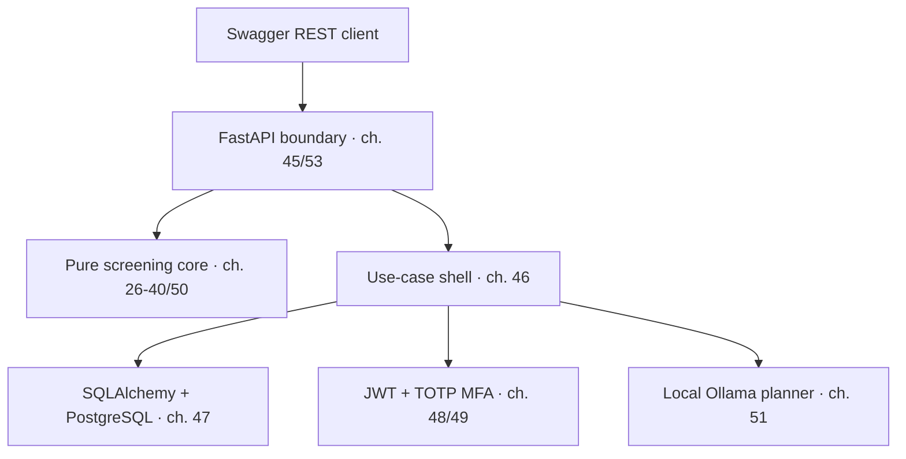

# Target Architecture You Will Build

The repository begins with only the course browser complete. Every other arrow becomes real as its referenced chapter passes.

The central rule is functional core, imperative shell:

- `app/domain/` must not import FastAPI, SQLAlchemy, HTTPX, JWT, PyOTP, PostgreSQL, or Ollama.
- domain functions accept frozen values and return frozen values or `Result`;
- time, UUIDs, database sessions, encryption, and HTTP remain at service/infrastructure boundaries;
- SQLAlchemy rows never cross a repository boundary;
- the model receives a deterministic evidence packet, never raw database authority;
- model output proposes experiments and may not declare reactor qualification.

Every implementation chapter has a corresponding chapter marker in `tests/acceptance/`. The default test run validates only the workshop scaffold; set `CHAPTER` to activate a milestone.
